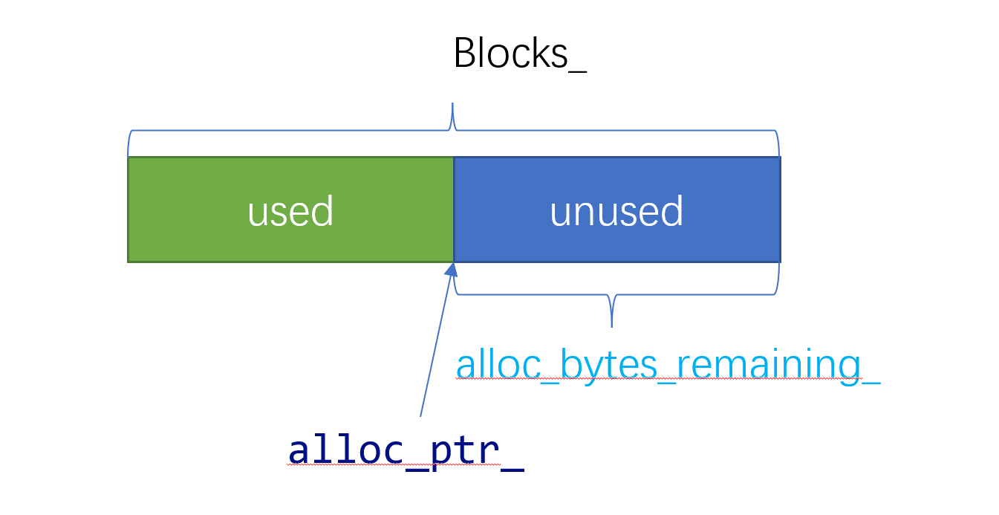
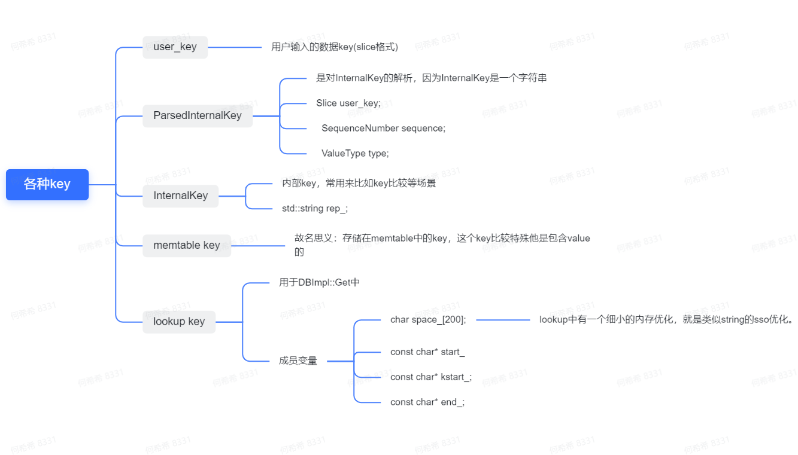
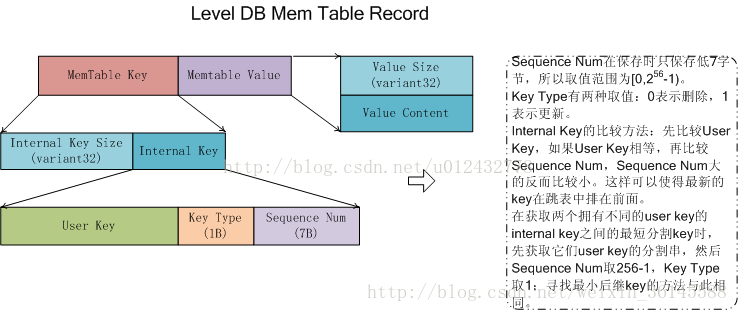
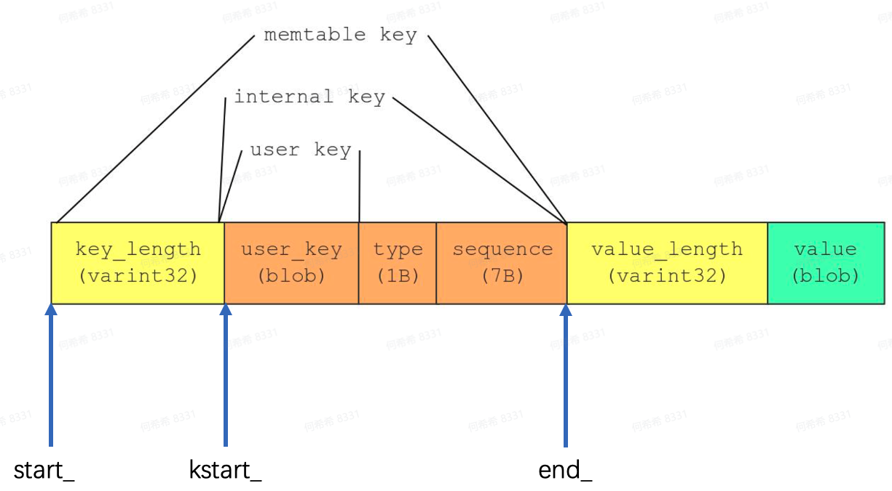

# LevelDB 部分组件

## status

用于记录leveldb中状态信息，保存错误码和对应的字符串错误信息(不过不支持自定义)。其基本组成


其中重要的成员对象如下图：


```c++
 private:
  enum Code {
    kOk = 0,
    kNotFound = 1,
    kCorruption = 2,
    kNotSupported = 3,
    kInvalidArgument = 4,
    kIOError = 5
  };
 
// 如果msg2为空则为 4位的长度 + 1位的code + msg
// 如果msg2不为空则为 4位的长度 + 1位的code + msg + ": " + msg2  
  Status::Status(Code code, const Slice& msg, const Slice& msg2) {
  assert(code != kOk);
  const uint32_t len1 = static_cast<uint32_t>(msg.size());
  const uint32_t len2 = static_cast<uint32_t>(msg2.size());
  const uint32_t size = len1 + (len2 ? (2 + len2) : 0); // 如果msg2为空的话，那么size就为len1，如果不为空的话，加上: 两个字符
  char* result = new char[size + 5];  // new 一个长度为 size + 5的数组，5为前四位表示的长度，加上code。
  std::memcpy(result, &size, sizeof(size)); // 首先复制长度
  result[4] = static_cast<char>(code); // 然后复制code
  std::memcpy(result + 5, msg.data(), len); // 复制msg
  if (len2) {  // 如果有msg2，则加上 :  再复制 msg2
    result[5 + len1] = ':';
    result[6 + len1] = ' ';
    std::memcpy(result + 7 + len1, msg2.data(), len2);
  }
  state_ = result;
}
// 根据状态码，返回相应的结果
std::string Status::ToString() const {
    //  ok state_为空
  if (state_ == nullptr) {
    return "OK";
  } else {
    char tmp[30];
    const char* type;
    switch (code()) {
      case kOk:
        type = "OK";
        break;
      case kNotFound:
        type = "NotFound: ";
        break;
      case kCorruption:
        type = "Corruption: ";
        break;
      case kNotSupported:
        type = "Not implemented: ";
        break;
      case kInvalidArgument:
        type = "Invalid argument: ";
        break;
      case kIOError:
        type = "IO error: ";
        break;
      default:
        snprintf(tmp, sizeof(tmp), "Unknown code(%d): ",
                 static_cast<int>(code()));
        type = tmp;
        break;
    }
    std::string result(type);
    uint32_t length;
    memcpy(&length, state_, sizeof(length));
    result.append(state_ + 5, length);
    return result;
  }
}

const char* Status::CopyState(const char* state) {
  uint32_t size;
  memcpy(&size, state, sizeof(size)); //先拷贝state的大小
  char* result = new char[size + 5]; 
  memcpy(result, state, size + 5); //拷贝所有
  return result;
}
```


## Slice

slice是leveldb中自定义的字符串处理类，主要是因为标准库中的string，

- 默认语意为拷贝，会损失性能(在可预期的条件下，指针传递即可)
- 标准库不支持remove_prefix和starts_with等函数，不太方便

```c++
 private:
  const char* data_;
  size_t size_;

  // Drop the first "n" bytes from this slice.
  void remove_prefix(size_t n) {
    assert(n <= size());
    data_ += n;
    size_ -= n;
  }

  // Return true iff "x" is a prefix of "*this"
  bool starts_with(const Slice& x) const {
    return ((size_ >= x.size_) &&
            (memcmp(data_, x.data_, x.size_) == 0));
  }

```


## skiplist


## arena

有内存频繁创建释放的地方就会有内存池的出现，leveldb也不例外。在im/memtable组件中，会有大量内存创建(数据持续put)和释放(dump到磁盘后内存结束)




```c++
class Arena {
 public:
  Arena();
  ~Arena();

  // Return a pointer to a newly allocated memory block of "bytes" bytes.
  // 跟malloc一样的效果
  char* Allocate(size_t bytes);

  // Allocate memory with the normal alignment guarantees provided by malloc
  // 分配对齐的内存
  char* AllocateAligned(size_t bytes);

  size_t MemoryUsage() const {
    return reinterpret_cast<uintptr_t>(memory_usage_.NoBarrier_Load());
  }

 private:
  char* AllocateFallback(size_t bytes);
  char* AllocateNewBlock(size_t block_bytes);

  // Allocation state
  char* alloc_ptr_;
  size_t alloc_bytes_remaining_;

  // Array of new[] allocated memory blocks
  std::vector<char*> blocks_;

  // Total memory usage of the arena.
  port::AtomicPointer memory_usage_;

  // No copying allowed
  Arena(const Arena&);
  void operator=(const Arena&);
};


inline char* Arena::Allocate(size_t bytes) {
  // The semantics of what to return are a bit messy if we allow
  // 0-byte allocations, so we disallow them here (we don't need
  // them for our internal use).
  // 说这么多，实际上就是不能出现申请的bytes数小于等于0的情况
  assert(bytes > 0);
  // 如果当前块余下的空间还够用
  if (bytes <= alloc_bytes_remaining_) {
    // 得到当前块的指针头
    char* result = alloc_ptr_;
    // 移动指针
    alloc_ptr_ += bytes;
    // 更新余下的bytes数
    alloc_bytes_remaining_ -= bytes;
    return result;
  }
  // 当余下的空间不够用的时候，这里就去申请一个新块
  // 如果要的bytes数目是大于1k，那么就申请bytes那么多。
  // 如果要的bytes数目小于1k，那么新申请的时候，就
  // 按照4k来申请，并且从里面扣.
  // Fallback的意思是说退化，也就是退化成直接用new了。
  // 如果内存只是比alloc_bytes_remaining_大一点点，那么就不用了。
  // 直接去拿一块新的4KB，然后打散掉
  // - 如果要的本来就是一块大的 >= 1KB，那么直接把这个大的挂在vector里面。然后就返回了。
  // - 如果要的小于1KB，那么就申请一个4KB，然后开始切碎了返回之。
  return AllocateFallback(bytes);
}

// Arena::AllocateFallback的意思说，当Arena里面余下的内存不够的时候
// 就从系统的内存里面再申请一些内存
// 相当于退化成了New
char* Arena::AllocateFallback(size_t bytes) {
  // 当要申请的内存数量大于4KB
  // 那么直接拿了然后返回回去
  // 同时继续复用以前没用完的内存
  if (bytes > kBlockSize / 4) {
    // Object is more than a quarter of our block size.  Allocate it separately
    // to avoid wasting too much space in leftover bytes.
    char* result = AllocateNewBlock(bytes);
    return result;
  }

  // 如果是小块的内存，也就是小于1kb的。那么申请一个大块4KB，然后
  // 从这一大块中扣一小块返回回去
  // 放弃以前的块中间的内存
  // We waste the remaining space in the current block.
  alloc_ptr_ = AllocateNewBlock(kBlockSize);
  alloc_bytes_remaining_ = kBlockSize;

  char* result = alloc_ptr_;
  alloc_ptr_ += bytes;
  alloc_bytes_remaining_ -= bytes;
  return result;
}

char* Arena::AllocateNewBlock(size_t block_bytes) {
  char* result = new char[block_bytes];
  blocks_.push_back(result);
  memory_usage_.NoBarrier_Store(
      reinterpret_cast<void*>(MemoryUsage() + block_bytes + sizeof(char*)));
  return result;
}

char* Arena::AllocateAligned(size_t bytes) {
  // 如果sizeof(void*)比8还要大，也就是遇到更高位的机器了？
  // 如果更大，就用sizeof(void*)来对齐
  // 否则就是用8来进行对齐
  const int align = (sizeof(void*) > 8) ? sizeof(void*) : 8;
  // 确保是2的指数次方
  assert((align & (align-1)) == 0);   // Pointer size should be a power of 2
  // 取得当前地址未对齐的尾数
  // 比如，要对齐的要求是8bytes
  // 但是当前指针指向的是0x017这里。
  // 那么余下的current_mod就是1
  size_t current_mod = reinterpret_cast<uintptr_t>(alloc_ptr_) & (align-1);
  // 注意，这里取地址的时候，由于只能向前走。
  // 假设地址是0x07。并且对齐的时候，要求是8bytes对齐。那么
  // 当前的地址只能是再向前走一个byte才可以对齐。
  // 所以这里的slop就是计算出需要向前走的长度。
  size_t slop = (current_mod == 0 ? 0 : align - current_mod);
  // bytes + slop，
  // 就是把余下的这个slop算在新的申请者头上
  // 返回的时候，直接向前移动slop个bytes
  // 就完成了对齐。
  size_t needed = bytes + slop;
  // 总结一下：AllocateAligned就是需要计算一下
  // 对齐地址

  char* result;
  // 这里的逻辑就与Allocate完全一样的了。
  // 除了会移动一下slop以外。
  if (needed <= alloc_bytes_remaining_) {
    result = alloc_ptr_ + slop;
    alloc_ptr_ += needed;
    alloc_bytes_remaining_ -= needed;
  } else {
    // AllocateFallback always returned aligned memory
    result = AllocateFallback(bytes);
  }
  // 这里断言一下，返回地址result肯定是对齐的。
  // 这里比较有意思的是，AllocateFallback()函数里面要的都是
  // 4KB，并且是直接使用new来操作的。那么可以认为拿到的内存本来就是
  // 已经对齐的。
  assert((reinterpret_cast<uintptr_t>(result) & (align-1)) == 0);
  return result;
}

```


## keys

### User_key


### ParsedInternalKey


### InternalKey


### LookupKey & Memtable key









```c++

```


## write_batch

```

```


# 参考

[LevelDB源码解析(5) WriteBatch | 胡刘郏的技术博客 (huliujia.com)](https://www.huliujia.com/blog/3c240f2a7b/)

[ leveldb(六)：key的不同种类型_uestc-leon的博客-CSDN博客](https://blog.csdn.net/weixin_36145588/article/details/76405441)

