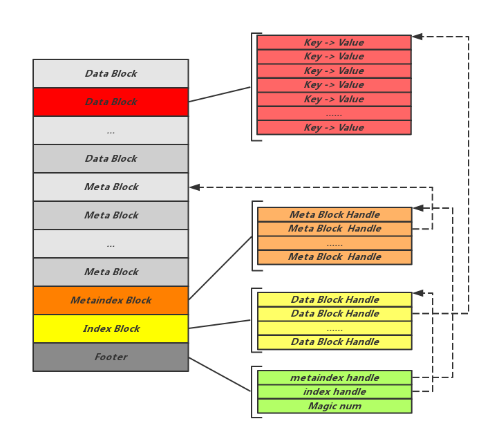
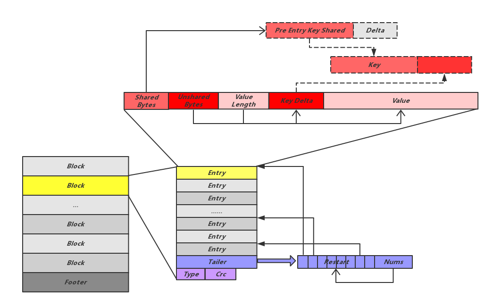

# LevelDB SST

## SST逻辑结构图

LevelDB将SST文件定义为Table，每个Table又划分为多个连续的Block，每个Block中又存储多条数据Entry：



- **Footer：**为于Table尾部，记录指向Metaindex Block的Handle和指向Index Block的Handle。需要说明的是Table中所有的Handle是通过偏移量Offset以及Size一同来表示的，用来指明所指向的Block位置。Footer是SST文件解析开始的地方，通过Footer中记录的这两个关键元信息Block的位置，可以方便的开启之后的解析工作。另外Footer种还记录了用于验证文件是否为合法SST文件的常数值Magicnum。

- **Index Block：**记录Data Block位置信息的Block，其中的每一条Entry指向一个Data Block，其Key值为所指向的Data Block最后一条数据的Key，Value为指向该Data Block位置的Handle。

- **Metaindex Block：**与Index Block类似，由一组Handle组成，不同的是这里的Handle指向的Meta Block。

- **Data Block：**以Key-Value的方式存储实际数据，其中Key定义为：

  ```
  DataBlock Key := UserKey + SequenceNum + Type
  Type := kDelete or kValue
  ```

  对比Memtable中的Key，可以发现Data Block中的Key并没有拼接UserKey的长度在UserKey前，这是由于上面讲到的物理结构中已经有了Key的长度信息。

- **Meta Block：**比较特殊的Block，用来存储元信息，目前LevelDB使用的仅有对布隆过滤器的存储。写入Data Block的数据会同时更新对应Meta Block中的过滤器。读取数据时也会首先经过布隆过滤器过滤。Meta Block的物理结构也与其他Block有所不同：

  ```
   [filter 0]
   [filter 1] 
   [filter 2] 
   ... 
   [filter N-1] 
   [offset of filter 0] : 4 bytes 
   [offset of filter 1] : 4 bytes 
   [offset of filter 2] : 4 bytes 
   ... 
   [offset of filter N-1] : 4 bytes 
   [offset of beginning of offset array] : 4 bytes 
   lg(base) : 1 byte
  ```

  其中每个filter节对应一段Key Range，落在某个Key Range的Key需要到对应的filter节中查找自己的过滤信息，base指定这个Range的大小。


## Block 物理格式




# 参考

[庖丁解LevelDB之数据存储 | CatKang的博客](https://catkang.github.io/2017/01/17/leveldb-data.html)

[leveldb-sst-file (axlgrep.github.io)](https://axlgrep.github.io/tech/leveldb-sst-file.html)